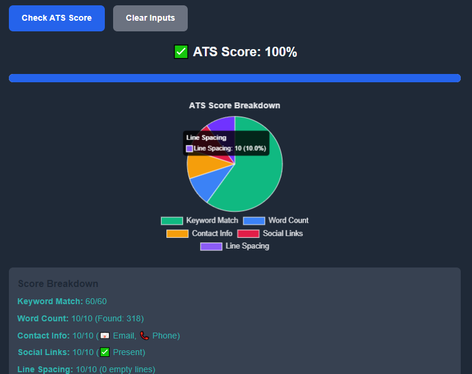
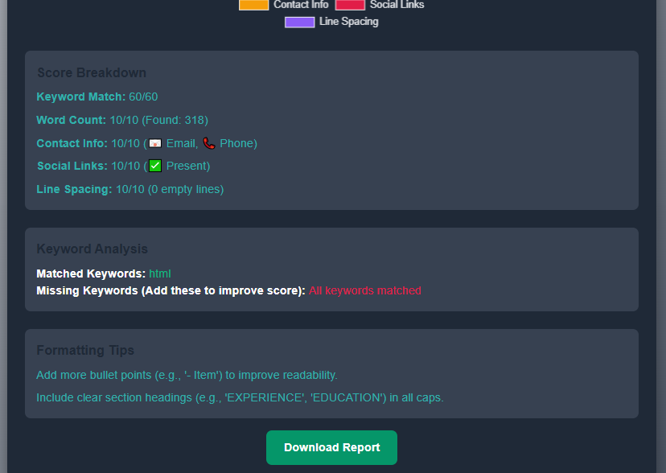
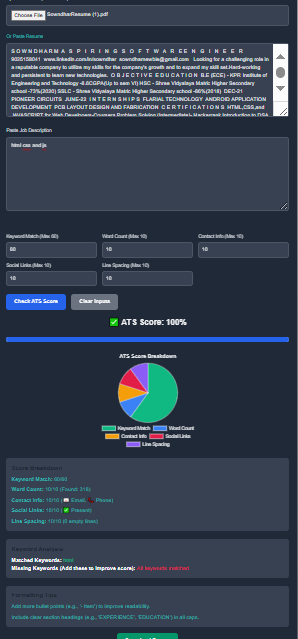
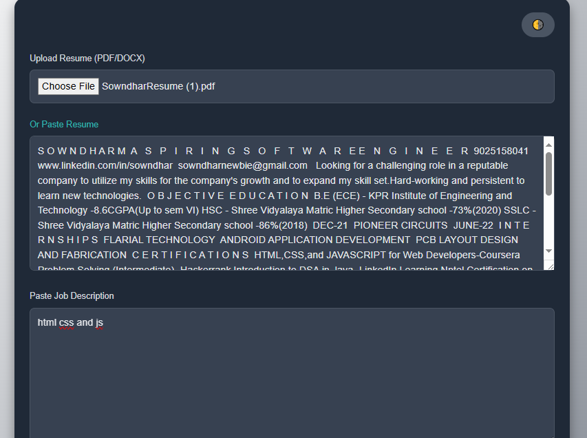

# ATS-resume-score-checker
ATS Score Checker

A web-based tool to evaluate how well a resume aligns with a job description for Applicant Tracking System (ATS) compatibility. Built with HTML, Tailwind CSS, JavaScript, Chart.js, pdf.js, and mammoth.js, this application calculates an ATS score based on keyword matching, word count, contact info, social links, and formatting, with features like customizable weights, a progress bar, and downloadable reports.

Features

Resume Upload or Input: Upload PDF/DOCX resumes or paste text directly.

ATS Score Calculation:

Keyword Match: Compares resume keywords to the job description (up to 60 points).

Word Count: Checks for optimal word count (300-900 words, up to 10 points).

Contact Info: Verifies email and phone presence (up to 10 points).

Social Links: Detects professional links (e.g., LinkedIn, GitHub, up to 10 points).

Line Spacing: Ensures minimal empty lines for ATS readability (up to 10 points).

Customizable Weights: Adjust the importance of each scoring component.

Visual Feedback:

Pie chart showing score breakdown using Chart.js.

  

Progress bar visualizing the total ATS score.

Keyword Analysis: Displays matched and missing keywords to optimize the resume.

  

Formatting Tips: Provides suggestions for better ATS compatibility (e.g., bullet points, headings).

Downloadable Report: Exports results as a text file.

Dark Mode: Toggle between light and dark themes for better usability.

Responsive Design: Adapts to mobile and desktop devices using Tailwind CSS.

Clear Inputs: Reset all inputs and results with a single button.

Demo

  

Screenshots

  

Installation

To run the project locally, follow these steps:

Install Dependencies: No server-side dependencies are required, as the project runs entirely in the browser. Ensure an internet connection to load external CDNs for Tailwind CSS, Chart.js, pdf.js, and mammoth.js.

Open the Application: Open index.html in a web browser (e.g., Chrome, Firefox) by double-clicking the file or using a local server for better performance:

Usage

Input Resume and Job Description:

Upload a resume in PDF or DOCX format, or paste the resume text into the provided textarea.

Paste the job description into the corresponding textarea.

Customize Weights:

Adjust the weights for each scoring component (Keyword Match, Word Count, Contact Info, Social Links, Line Spacing) using the number inputs. Defaults are 60, 10, 10, 10, and 10, respectively.

Calculate Score:

Click "Check ATS Score" to analyze the resume and display:

Total ATS score (as a percentage).

Progress bar visualizing the score.

Pie chart breaking down the score components.

Keyword analysis (matched and missing keywords).

Formatting tips to improve ATS compatibility.

Interact with Results:

Review the score breakdown and keyword analysis to identify areas for improvement.

Use formatting tips to optimize the resume structure.

Click "Download Report" to save the results as a text file.

Click "Clear Inputs" to reset the form and start over.

Toggle Dark Mode:

Click the 🌗 button to switch between light and dark themes.

Technologies Used

HTML5: Structure of the web application.

Tailwind CSS: Responsive and modern UI styling.

JavaScript: Logic for score calculation, file processing, and chart rendering.

Chart.js: Generates the pie chart for score breakdown.

pdf.js: Extracts text from uploaded PDF resumes.

mammoth.js: Extracts text from uploaded DOCX resumes.

Implementation Details

Score Calculation:

Keyword Match: Extracts unique keywords (4+ letters, excluding stopwords) from the job description and calculates a score based on matches in the resume, scaled by the user-defined weight (default: 60).

Word Count: Awards full points for 300-900 words, half otherwise, scaled by weight (default: 10).

Contact Info: Checks for email and phone using regex, awarding full points if both are present, scaled by weight (default: 10).

Social Links: Detects URLs for LinkedIn, GitHub, etc., awarding full points if present, scaled by weight (default: 10).

Line Spacing: Awards full points for ≤5 empty lines, half otherwise, scaled by weight (default: 10).

Total score is normalized to a percentage based on the sum of weights.

File Processing: Uses pdf.js for PDFs and mammoth.js for DOCX files to extract text client-side.

Visualizations:

A responsive pie chart (Chart.js) shows the score breakdown with dynamic tooltips displaying values and percentages.

A progress bar animates to reflect the total score.

Keyword Analysis: Lists matched (green) and missing (red) keywords to guide resume optimization.

Formatting Tips: Checks for bullet points, headings, and word count, providing actionable suggestions.

Dark Mode: Toggles between light and dark themes, updating text, backgrounds, and chart colors.

Limitations
Keyword Matching: Relies on simple string matching, which may miss synonyms or context-specific terms.

File Processing: Limited to text extraction; complex formatting in PDFs/DOCX may not be fully captured.

Weight Constraints: Users must ensure weights are reasonable to avoid skewed scoring.

No Real-Time Validation: Input validation is basic (e.g., no check for negative weights).
